# Machina - MCP Registry Platform

<div align="center">


**DevQ.ai's Unified MCP Server Registry with Health Monitoring and Configuration Management**

[](#production-status)
[](#mcp-servers)
[](#fastmcp-framework)
[](#requirements)
[](LICENSE)

</div>

## 🎯 Overview

Machina is DevQ.ai's production-ready MCP (Model Context Protocol) registry platform that provides unified access to 13 specialized MCP servers for AI-powered development workflows. Built with the FastMCP framework, it offers comprehensive health monitoring, automatic failover, and seamless integration with AI agents and coding assistants.

### ⚡ Key Features

- **🔍 Unified Server Discovery** - Single registry for all MCP servers with intelligent routing
- **📊 Real-time Health Monitoring** - Continuous health checks with automatic failover
- **🚀 FastMCP Framework** - High-performance framework with built-in observability
- **🛠️ 119+ Tools** - Comprehensive tool coverage across all development domains
- **🔐 Production Security** - Secure authentication, credential management, and error handling
- **📈 Observability First** - Built-in Logfire integration for monitoring and analytics
- **🌐 Cross-platform** - Works on macOS, Linux, and Windows environments

## 🏗️ Architecture

```mermaid
graph TB
    subgraph "Machina Registry Platform"
        Registry[MCP Registry Core]
        Health[Health Monitor]
        FastMCP[FastMCP Framework]
    end

    subgraph "Knowledge Servers"
        Context7[Context7 MCP]
        Memory[Memory MCP]
        Sequential[Sequential Thinking MCP]
    end

    subgraph "Development Servers"
        FastAPI[FastAPI MCP]
        PyTest[PyTest MCP]
        PydanticAI[Pydantic AI MCP]
    end

    subgraph "Infrastructure Servers"
        Docker[Docker MCP]
        Logfire[Logfire MCP]
        Registry2[Registry MCP]
    end

    subgraph "Web & Data Servers"
        Crawl4AI[Crawl4AI MCP]
        GitHub[GitHub MCP]
        SurrealDB[SurrealDB MCP]
    end

    subgraph "Framework Servers"
        FastMCPServer[FastMCP MCP]
    end

    Registry --> Health
    Registry --> FastMCP

    FastMCP --> Context7
    FastMCP --> Memory
    FastMCP --> Sequential
    FastMCP --> FastAPI
    FastMCP --> PyTest
    FastMCP --> PydanticAI
    FastMCP --> Docker
    FastMCP --> Logfire
    FastMCP --> Registry2
    FastMCP --> Crawl4AI
    FastMCP --> GitHub
    FastMCP --> SurrealDB
    FastMCP --> FastMCPServer

    Health --> Context7
    Health --> Memory
    Health --> Sequential
    Health --> FastAPI
    Health --> PyTest
    Health --> PydanticAI
    Health --> Docker
    Health --> Logfire
    Health --> Registry2
    Health --> Crawl4AI
    Health --> GitHub
    Health --> SurrealDB
    Health --> FastMCPServer
```



## 🚀 Quick Start

### Prerequisites

- **Python 3.12+** - Modern Python environment
- **Git** - For repository cloning
- **Docker** - Optional, for container operations
- **Redis** - Optional, for Context7 server

### Installation

```bash
# Clone the repository
git clone https://github.com/devq-ai/machina.git
cd machina

# Install dependencies
pip install -r requirements.txt

# Configure environment (copy and customize)
cp .env.example .env
```

### Environment Configuration

Create a `.env` file with your API keys and configurations:

```bash
# Required API Keys
OPENAI_API_KEY=sk-...
ANTHROPIC_API_KEY=sk-ant-...
GITHUB_TOKEN=ghp_...

# Database Configuration
SURREALDB_URL=ws://localhost:8000/rpc
SURREALDB_USERNAME=root
SURREALDB_PASSWORD=root

# Optional Services
UPSTASH_REDIS_REST_URL=https://...
UPSTASH_REDIS_REST_TOKEN=...
LOGFIRE_TOKEN=pylf_v1_us_...
DOCKER_HOST=unix:///var/run/docker.sock
```

### Start the Registry

```bash
# Validate environment
python registry/main.py --validate-only

# Start the complete registry
python registry/main.py

# Or start individual servers
python -m mcp_servers.docker_mcp
python -m mcp_servers.github_mcp
python -m mcp_servers.context7_mcp
```

## 📦 MCP Servers

### Production-Ready Server Suite (13/13 Complete ✅)

<table>
<tr>
<th>Category</th>
<th>Server</th>
<th>Framework</th>
<th>Tools</th>
<th>Description</th>
<th>Status</th>
</tr>

<!-- Knowledge & Context Servers -->
<tr>
<td rowspan="3"><strong>Knowledge</strong></td>
<td><strong>Context7 MCP</strong></td>
<td>FastMCP</td>
<td>15+</td>
<td>Redis-backed contextual reasoning with vector embeddings</td>
<td>🟢 Ready</td>
</tr>
<tr>
<td><strong>Memory MCP</strong></td>
<td>FastMCP</td>
<td>8</td>
<td>Persistent memory management with search capabilities</td>
<td>🟢 Ready</td>
</tr>
<tr>
<td><strong>Sequential Thinking MCP</strong></td>
<td>FastMCP</td>
<td>9</td>
<td>Step-by-step problem solving and reasoning chains</td>
<td>🟢 Ready</td>
</tr>

<!-- Development Servers -->
<tr>
<td rowspan="3"><strong>Development</strong></td>
<td><strong>FastAPI MCP</strong></td>
<td>FastMCP</td>
<td>6</td>
<td>FastAPI project generation with automated scaffolding</td>
<td>🟢 Ready</td>
</tr>
<tr>
<td><strong>PyTest MCP</strong></td>
<td>FastMCP</td>
<td>7</td>
<td>Python testing framework with automated test generation</td>
<td>🟢 Ready</td>
</tr>
<tr>
<td><strong>Pydantic AI MCP</strong></td>
<td>FastMCP</td>
<td>8</td>
<td>AI agent management with type-safe operations</td>
<td>🟢 Ready</td>
</tr>

<!-- Infrastructure Servers -->
<tr>
<td rowspan="3"><strong>Infrastructure</strong></td>
<td><strong>Docker MCP</strong></td>
<td>FastMCP</td>
<td>13</td>
<td>Container management and orchestration</td>
<td>🟢 Ready</td>
</tr>
<tr>
<td rowspan="1"><strong>Infrastructure</strong></td>
<td><strong>Logfire MCP</strong></td>
<td>FastMCP</td>
<td>12</td>
<td>Comprehensive observability and monitoring</td>
<td>🟢 Ready</td>
</tr>
<tr>
<td rowspan="1"><strong>Infrastructure</strong></td>
<td><strong>Registry MCP</strong></td>
<td>FastMCP</td>
<td>7</td>
<td>MCP server discovery and registry management</td>
<td>🟢 Ready</td>
</tr>

<!-- Web & Data Servers -->
<tr>
<td rowspan="3"><strong>Web & Data</strong></td>
<td><strong>Crawl4AI MCP</strong></td>
<td>FastMCP</td>
<td>6</td>
<td>Web crawling with AI-powered content processing</td>
<td>🟢 Ready</td>
</tr>
<tr>
<td><strong>GitHub MCP</strong></td>
<td>FastMCP</td>
<td>8</td>
<td>GitHub repository operations and issue tracking</td>
<td>🟢 Ready</td>
</tr>
<tr>
<td><strong>SurrealDB MCP</strong></td>
<td>Standard MCP</td>
<td>13</td>
<td>Multi-model database with graph capabilities</td>
<td>🟢 Ready</td>
</tr>

<!-- Framework Servers -->
<tr>
<td><strong>Framework</strong></td>
<td><strong>FastMCP MCP</strong></td>
<td>Standard MCP</td>
<td>Framework</td>
<td>FastMCP framework status and management</td>
<td>🟢 Ready</td>
</tr>

</table>

### Tool Coverage Summary

- **Total Tools**: 119+ tools across all servers
- **FastMCP Servers**: 11/13 (85%) using modern FastMCP framework
- **Standard MCP**: 2/13 (15%) using standard MCP protocol
- **Production Ready**: 100% of servers ready for deployment
- **Health Monitoring**: All servers with comprehensive health checks

## 🛠️ Development Tools

### CLI Frontend Implementation

The repository includes a complete CLI frontend implementation with beautiful terminal interfaces:

**Location**: `devgen/PRPs/templates/supporting_docs/cli_frontend/`

**Features**:
- 🎨 **Cyber & Pastel Themes** - Beautiful terminal UI with modern design
- 📋 **Interactive Playbook Execution** - Visual workflow automation
- 🏗️ **Project Management** - Complete project lifecycle tools
- 📦 **Template System** - Reusable project scaffolding
- ⚙️ **Configuration Management** - Interactive configuration editing

**Quick Start**:
```bash
cd devgen/PRPs/templates/supporting_docs/cli_frontend
chmod +x setup.sh
./setup.sh
make build
./build/devgen playbook run example-playbook.yaml
```

**Documentation**: [Complete User Guide](devgen/PRPs/templates/supporting_docs/cli_frontend/USER_GUIDE.md)

## 🔧 FastMCP Framework

Machina is built on the FastMCP framework, providing:

### Core Components

- **`fastmcp/core.py`** - High-performance MCP server framework
- **`fastmcp/tools.py`** - Auto-generated schemas and tool registry
- **`fastmcp/health.py`** - Comprehensive health monitoring
- **`fastmcp/registry.py`** - Server registration and discovery

### Key Features

```python
from fastmcp import FastMCP
import logfire

# Create FastMCP server with built-in observability
server = FastMCP("my-server")

@server.tool()
async def my_tool(param: str) -> str:
    """Tool with automatic schema generation and error handling"""
    with logfire.span("Tool execution", param=param):
        return f"Result: {param}"

# Automatic health monitoring and error recovery
server.run()
```

### Benefits

- **⚡ High Performance** - Optimized for speed and reliability
- **🔍 Auto-instrumentation** - Built-in Logfire observability
- **🛡️ Error Handling** - Comprehensive error recovery
- **📊 Health Monitoring** - Continuous health checks
- **🎯 Type Safety** - Full Python type hint support

## 📊 Production Status

### Verification Results

```bash
# Run comprehensive verification
python verify_production_servers.py

✅ PRODUCTION VERIFICATION COMPLETE
📊 Results Summary:
   • Total Servers Tested: 13/13
   • Verification Pass Rate: 100%
   • Failed Servers: 0
   • Production Ready: ALL SERVERS ✅

🎉 ALL 13 SERVERS PRODUCTION READY FOR DEPLOYMENT!
```

### Performance Metrics

- **🚀 Fast Initialization**: All servers start under 1 second
- **💾 Memory Efficient**: Optimized resource usage
- **🔄 Auto-recovery**: Graceful error handling and recovery
- **📈 Scalable**: Designed for production workloads
- **🔒 Secure**: Comprehensive security implementation

### Security Features

- ✅ Environment variable-based authentication
- ✅ Credential scrubbing in logs
- ✅ Input validation and sanitization
- ✅ Secure token management
- ✅ Error handling without information leakage

## 🔗 Integration Examples

### Using with Claude Desktop

Add to your Claude Desktop MCP configuration:

```json
{
  "mcpServers": {
    "machina-registry": {
      "command": "python",
      "args": ["registry/main.py"],
      "cwd": "/path/to/machina",
      "env": {
        "OPENAI_API_KEY": "your-key",
        "ANTHROPIC_API_KEY": "your-key",
        "GITHUB_TOKEN": "your-token"
      }
    }
  }
}
```

### Using Individual Servers

```json
{
  "mcpServers": {
    "docker-mcp": {
      "command": "python",
      "args": ["-m", "mcp_servers.docker_mcp"],
      "cwd": "/path/to/machina"
    },
    "github-mcp": {
      "command": "python",
      "args": ["-m", "mcp_servers.github_mcp"],
      "cwd": "/path/to/machina",
      "env": {
        "GITHUB_TOKEN": "your-token"
      }
    }
  }
}
```

### Using with Zed IDE

Add to your `.zed/settings.json`:

```json
{
  "mcpServers": {
    "machina-docker": {
      "command": "python",
      "args": ["-m", "mcp_servers.docker_mcp"],
      "cwd": "/path/to/machina"
    },
    "machina-github": {
      "command": "python",
      "args": ["-m", "mcp_servers.github_mcp"],
      "cwd": "/path/to/machina",
      "env": {
        "GITHUB_TOKEN": "${GITHUB_TOKEN}"
      }
    }
  }
}
```

## 🧪 Testing

### Run All Tests

```bash
# Install test dependencies
pip install pytest pytest-asyncio pytest-cov

# Run comprehensive test suite
python -m pytest tests/ -v --cov=fastmcp --cov=mcp_servers

# Run specific server tests
python -m pytest tests/test_registry.py -v

# Run production verification
python verify_production_servers.py
```

### Test Coverage

- **Unit Tests**: All core framework components
- **Integration Tests**: Server registration and discovery
- **Health Monitoring**: Continuous health check validation
- **Error Handling**: Comprehensive error scenario testing
- **Production Verification**: End-to-end deployment testing

## 📖 Documentation

### Core Documentation

- **[CHANGELOG.md](CHANGELOG.md)** - Complete version history and features
- **[CLI User Guide](devgen/PRPs/templates/supporting_docs/cli_frontend/USER_GUIDE.md)** - Comprehensive CLI documentation
- **[Style Guide](devgen/PRPs/templates/supporting_docs/cli_frontend/style_guide.md)** - UI design system and themes

### API References

- **FastMCP Framework** - High-performance MCP server framework
- **Registry API** - Server registration and discovery
- **Health Monitoring** - Continuous health check system
- **Tool Registry** - Comprehensive tool management

### Development Guides

- **Server Development** - Creating new MCP servers
- **Tool Implementation** - Adding new tools to servers
- **Health Checks** - Implementing custom health monitoring
- **Deployment** - Production deployment strategies

## 🤝 Contributing

### Development Setup

```bash
# Clone and setup
git clone https://github.com/devq-ai/machina.git
cd machina
pip install -r requirements.txt

# Install development dependencies
pip install -r requirements-dev.txt

# Run tests
python -m pytest tests/ -v

# Run linting
flake8 fastmcp/ mcp_servers/
black fastmcp/ mcp_servers/
mypy fastmcp/ mcp_servers/
```

### Adding New Servers

1. **Create server file** in `mcp_servers/`
2. **Use FastMCP framework** for optimal performance
3. **Add comprehensive tests** in `tests/`
4. **Update registry** in `registry/main.py`
5. **Add documentation** and examples

### Code Standards

- **Python 3.12+** with type hints
- **FastMCP framework** for new servers
- **Logfire integration** for observability
- **Comprehensive error handling**
- **Security best practices**
- **Performance optimization**

## 📄 License

This project is licensed under the MIT License - see the [LICENSE](LICENSE) file for details.

## 🙏 Acknowledgments

- **[Model Context Protocol](https://modelcontextprotocol.io/)** - For the amazing MCP standard
- **[Anthropic](https://www.anthropic.com/)** - For Claude and MCP development
- **[DevQ.ai Team](https://devq.ai/)** - For development standards and best practices
- **Open Source Community** - For inspiration and collaboration

## 🔗 Links

- **[DevQ.ai Website](https://devq.ai/)** - DevQ.ai development platform
- **[MCP Documentation](https://modelcontextprotocol.io/)** - Official MCP documentation
- **[FastMCP Framework](https://github.com/jlowin/fastmcp)** - High-performance MCP framework
- **[Issue Tracker](https://github.com/devq-ai/machina/issues)** - Report bugs and request features
- **[Discussions](https://github.com/devq-ai/machina/discussions)** - Community discussions

---

<div align="center">

**Made with ❤️ by the DevQ.ai Team**

*Empowering AI-driven development workflows with production-ready MCP servers*

[](https://devq.ai/)

</div>
